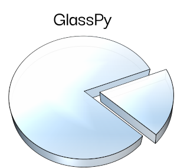

# Welcome to GlassPy
[](https://zenodo.org/badge/latestdoi/197668520)

GlassPy is a Python module for scientists working with glass materials.



## What is it?
The aim is to provide classes and functions written in Python for materials scientists working with glass and non-crystalline materials. The hope is that with an open and collaborative project, we can build a reliable toolset to support faster and reproducible research on this topic.

## How to install
The source code is hosted on GitHub at https://github.com/drcassar/glasspy.

Binary installers for the latest released version (v0.3) are available at the [Python Package Index](https://pypi.org/project/glasspy/). To install GlassPy using pip run

```sh
pip install glasspy
```

To install the latest development version of GlassPy run

```sh
pip install --upgrade git+git://github.com/drcassar/glasspy@dev
```

## Development
GlassPy was born as a personal tool back in 2013 when I started coding with Python. It is based on a collection of MATLAB code that I wrote for the Glass State graduate course of 2010 and the numerical analysis during my PhD.

Right now, I'm sorting all my code and adequately documenting it to build this Python module. My personal objective is to increase my research's reproducibility and hopefully be useful for researchers working in the field of glass science.

## Documentation
There is no documentation right now, but all the functions have detailed docstring.

Some examples are provided as notebooks in Google Colab (they run in the cloud, so you can test GlassPy without the need of installing anything on your machine):

- [Finding the Kauzmann Temperature](https://colab.research.google.com/drive/1WAVddrOSDG7_pydV9g-WBfBisKQrMVeF)
- [Regression of nucleation density data](https://colab.research.google.com/drive/139ke_S3eNq6MvJ3A_GnTWtlI8rn2QwKf)
- [Regression of viscosity data](https://colab.research.google.com/drive/1U_xSg4H-de9QDlXChCN9Tsda8VlBlbAI)
- [Nucleation kinetic model](https://colab.research.google.com/drive/1mRAr0HNXcO5YaAFktir-Kb9K4ZUdiXk_)

## Dependencies
- [Python 3.6+](https://www.python.org/)
- [NumPy](https://www.numpy.org)
- [SciPy](https://www.scipy.org/)
- [Pandas](https://pandas.pydata.org/)
- [lmfit](https://lmfit.github.io/lmfit-py/)
- [chemparse](https://pypi.org/project/chemparse/)

## How to cite
Daniel R. Cassar. (2020, July 4). drcassar/glasspy: GlassPy 0.3 (Version v0.3). Zenodo. http://doi.org/10.5281/zenodo.3930351

## List of open source tools for glass scientists
- [RelaxPy](https://github.com/Mauro-Glass-Group/RelaxPy) - For computing glass relaxation kinetics.
- [KineticPy](https://github.com/Mauro-Glass-Group/KineticPy) - For calculating the kinetics of an energy landscape on an arbitrary long timescale. 
- [ExplorerPy](https://github.com/Mauro-Glass-Group/ExplorerPy) - For mapping energy landscape with a variety of methods. 
- [SpectraFit](https://github.com/itscoe/SpectraFit.jl) - For fitting Boron-10 NMR data. 
- [PyGlass](https://github.com/jrafolsr/PyGlass) - For simulating the specific heat signature of glasses with a specified thermal treatment following the Tool-Narayanaswamy-Moynihan model.

Let me know if you want to add your open source software to this list.

## SciGlass database licence
[ODbL](https://github.com/drcassar/glasspy/blob/master/glasspy/data/datafiles/LICENCE_sciglass)

ODC Open Database License (ODbL)

Copyright (c) 2019 EPAM Systems

## GlassPy license
[GPL](https://github.com/drcassar/glasspy/blob/master/LICENSE)

GlassPy, Python module for scientists working with glass materials. Copyright (C) 2019-2020 Daniel Roberto Cassar

This program is free software: you can redistribute it and/or modify it under the terms of the GNU General Public License as published by the Free Software Foundation, either version 3 of the License, or (at your option) any later version.

This program is distributed in the hope that it will be useful, but WITHOUT ANY WARRANTY; without even the implied warranty of MERCHANTABILITY or FITNESS FOR A PARTICULAR PURPOSE.  See the GNU General Public License for more details.
