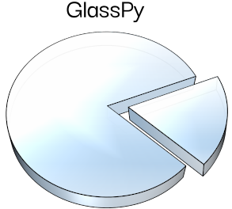

# Welcome to GlassPy
[](https://zenodo.org/badge/latestdoi/197668520)

GlassPy is a Python module for scientists working with glass materials.



## What is it?
GlassPy's current focus is on providing an easy way to load SciGlass data and use GlassNet and ViscNet, two deep learning predictive models of glass and glass-forming liquid properties. Click [here](https://glasspy.readthedocs.io) for the documentation.

## How to install
The source code is available on GitHub at https://github.com/drcassar/glasspy.

Binary installers for the latest released version are available from the [Python Package Index](https://pypi.org/project/glasspy/). To install GlassPy with pip run

```sh
pip install glasspy
```

## Development
GlassPy is under development. API changes are not only likely, but expected as development continues.

## How to cite
D.R. Cassar, GlassNet: a multitask deep neural network for predicting many glass properties, (2023). https://doi.org/10.48550/arXiv.2303.15538.

## GlassPy license
[GPL](https://github.com/drcassar/glasspy/blob/master/LICENSE)

GlassPy, Python module for scientists working with glass materials. Copyright (C) 2019-2023 Daniel Roberto Cassar

This program is free software: you can redistribute it and/or modify it under the terms of the GNU General Public License as published by the Free Software Foundation, either version 3 of the License, or (at your option) any later version.

This program is distributed in the hope that it will be useful, but WITHOUT ANY WARRANTY; without even the implied warranty of MERCHANTABILITY or FITNESS FOR A PARTICULAR PURPOSE.  See the GNU General Public License for more details.
