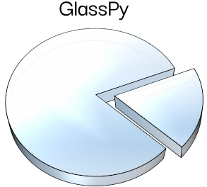

# Welcome to GlassPy
[](https://zenodo.org/badge/latestdoi/197668520)

GlassPy is a Python module for scientists working with glass materials.



## What is it?
GlassPy focuses on providing an easy way to load SciGlass data and use GlassNet, VITRIFY, and ViscNet — predictive models of glass and glass-forming liquid properties. Documentation is available [here](https://glasspy.readthedocs.io) (check the examples section for a quick overview).

## How to install
The source code is available on GitHub at https://github.com/drcassar/glasspy.

Binary installers for the latest released version are available from the [Python Package Index](https://pypi.org/project/glasspy/).

> [!WARNING]
> Before installing GlassPy, make sure that you have `pytorch` installed (see the instructions [here](https://pytorch.org/get-started/locally/)).

To install GlassPy with `pip` run

```sh
pip install glasspy
```

To install GlassPy with `uv` run 

```sh
uv pip install glasspy
```

## Development
GlassPy is under development. API changes are not only likely, but expected as development continues.

## How to cite

If GlassPy or GlassNet was useful in your research, please cite the following paper:

> Cassar, D.R. (2023). GlassNet: A multitask deep neural network for predicting many glass properties. Ceramics International 49, 36013–36024. https://doi.org/10.1016/j.ceramint.2023.08.281.

If VITRIFY was useful in your research, please cite the following paper:

> Carvalho, D.P.L., Loponi, A.C.B., Cassar, D.R. (2026). Will it form a glass? Tackling glass formation using binary classification. Paper under peer review. 

If ViscNet was useful in your research, please cite the following paper:

> Cassar, D.R. (2021). ViscNet: Neural network for predicting the fragility index and the temperature-dependency of viscosity. Acta Materialia 206, 116602. https://doi.org/10.1016/j.actamat.2020.116602.


## GlassPy license
[GPL](https://github.com/drcassar/glasspy/blob/master/LICENSE)

GlassPy, Python module for scientists working with glass materials. Copyright (C) 2019-2026 Daniel Roberto Cassar

This program is free software: you can redistribute it and/or modify it under the terms of the GNU General Public License as published by the Free Software Foundation, either version 3 of the License, or (at your option) any later version.

This program is distributed in the hope that it will be useful, but WITHOUT ANY WARRANTY; without even the implied warranty of MERCHANTABILITY or FITNESS FOR A PARTICULAR PURPOSE.  See the GNU General Public License for more details.
